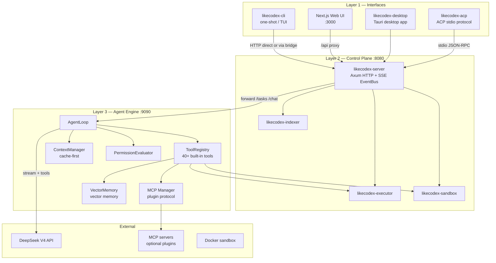

# LikeCodex

[](https://github.com/JasonBuildAI/likecodex/actions/workflows/ci.yml)
[](LICENSE)
[](https://www.python.org/downloads/)
[](https://www.rust-lang.org/)
[](https://nodejs.org/)

**LikeCodex** is an open-source **coding agent** powered by **DeepSeek V4**. You describe a task in natural language; the agent reads your codebase, runs commands, edits files, and reports back — with optional human approval for risky operations.

Unlike a thin LLM wrapper or a monolithic Python app, LikeCodex uses a **deliberate split architecture**: Rust for control, safety, and I/O; Python for agent intelligence; Next.js for a rich browser UI; Tauri for a desktop application. The entire system is tuned for **DeepSeek prefix caching** so multi-turn tool loops stay fast and cheap.

**[中文文档 README.zh-CN.md](README.zh-CN.md)**

---

## Table of Contents

- [What Problem Does LikeCodex Solve?](#what-problem-does-likecodex-solve)
- [Core Design Principles](#core-design-principles)
- [Architecture at a Glance](#architecture-at-a-glance)
- [The Four Layers](#the-four-layers)
- [How a Task Runs End-to-End](#how-a-task-runs-end-to-end)
- [The Agent Loop (Heart of the System)](#the-agent-loop-heart-of-the-system)
- [Cache-First Context (Why LikeCodex Is Different)](#cache-first-context-why-likecodex-is-different)
- [Planning, Sub-Agents, and Skills](#planning-sub-agents-and-skills)
- [Security and Execution Routing](#security-and-execution-routing)
- [Event Protocol (One Stream for All Clients)](#event-protocol-one-stream-for-all-clients)
- [ACP Protocol](#acp-protocol)
- [Quick Start](#quick-start)
- [Configuration](#configuration)
- [Built-in Tools](#built-in-tools)
- [Project Layout](#project-layout)
- [Documentation](#documentation)
- [License](#license)

---

## What Problem Does LikeCodex Solve?

Programming agents need to do three hard things at once:

1. **Reason** — break a vague request into steps, call tools, recover from errors.
2. **Act safely** — read/write files and run shell commands without destroying your machine.
3. **Stay usable** — stream progress to terminal and browser, ask permission when needed, resume sessions.

Most tools pick one stack and compromise on the others. LikeCodex separates concerns:

| Concern | Layer | Language | Why here |
|---------|-------|----------|----------|
| User interfaces | CLI, TUI, Web, Tauri desktop | Rust + TypeScript | Fast startup, rich UX |
| HTTP bridge, SSE, sandbox gateway | Control plane | Rust | Safe I/O, one event bus |
| LLM loop, tools, planning, memory | Agent engine | Python | Rapid iteration on agent logic |
| Shell/git execution, Docker isolation | Execution | Rust | Path confinement, low overhead |

**Default model:** `deepseek-v4-flash` via [DeepSeek OpenAI-compatible API](https://api.deepseek.com). Optional planner model: `deepseek-v4-pro`.

---

## Core Design Principles

### 1. Separation of control and intelligence

Rust never calls the LLM. Python never spawns Docker directly from arbitrary user input without going through permission checks. Each layer has a narrow job:

- **Rust** — HTTP, SSE broadcast, session proxy, local/sandbox execution, config loading, code indexing, ACP protocol.
- **Python** — `AgentLoop`, tool registry, context assembly & compaction, LLM streaming, MCP integration, memory management.

This lets you change agent behavior (Python) without rewriting the security boundary (Rust).

### 2. One event stream for every client

CLI, TUI, Web, and ACP all consume the **same SSE event schema** from `likecodex-server`. Python emits raw stream chunks; Rust normalizes them in `event_mapping.rs`. You see the same tool cards, permission prompts, and retry notices everywhere.

### 3. Cache stability as a first-class invariant

DeepSeek **automatic context caching** only hits when the prompt prefix (from token 0) is **byte-identical** across turns. LikeCodex structures every conversation as:

```text
┌─────────────────────────────────────┐
│ IMMUTABLE PREFIX  (never rewritten) │  system.md + skills + tool schemas
├─────────────────────────────────────┤
│ APPEND-ONLY LOG   (grows forward)   │  user → assistant → tool → …
├─────────────────────────────────────┤
│ VOLATILE SCRATCH  (never sent)      │  debug, raw planner dumps
└─────────────────────────────────────┘
```

This is not an optimization bolt-on — it shapes how sessions, compaction, planner isolation, and tool JSON serialization work. See [Cache-First Context](#cache-first-context-why-likecodex-is-different).

### 4. Defense in depth

File tools are confined to the workspace. Shell commands are risk-classified. Approval modes gate writes and execution. High-risk commands can route to a **Docker sandbox**. Checkpoints snapshot files before writes so you can rewind. Per-tool policy rules (allow/ask/deny) provide fine-grained control.

---

## Architecture at a Glance



**Daily startup** (recommended):

```bash
likecodex setup          # first time: API key, config, LIKECODEX.md
likecodex start --web    # engine :9090 + server :8080 + web :3000
likecodex code           # terminal-only TUI
```

Contributors can still use `scripts/dev.sh` / `scripts/dev.ps1` for hot reload.

---

## The Four Layers

### Layer 1 — Interfaces

| Component | Entry | Role |
|-----------|-------|------|
| **likecodex-cli** | `likecodex`, `likecodex code`, `likecodex start` | One-shot runs, Ratatui TUI, stack supervisor, `setup` / `doctor` |
| **web/** | http://127.0.0.1:3000 | Three-column UI: sessions / chat / diff; permission modal; session resume |
| **likecodex-desktop** | Tauri 2 desktop app | Native window wrapping Web UI, 1280x800 |
| **likecodex-acp** | stdio JSON-RPC | Agent Client Protocol v1 for editor integration (VS Code, Zed) |

The CLI can talk **directly** to the Python engine (`--engine-url http://127.0.0.1:9090`) or through the Rust server (same path as Web).

### Layer 2 — Control plane (`likecodex-server`)

Rust Axum server on **port 8080**. Responsibilities:

- **Engine bridge** — forward `POST /tasks`, `/chat`, `/run`, `/plan` to Python `:9090`.
- **Event bus** — `GET /events` SSE stream for all clients.
- **Permissions API** — `GET /permissions/pending`, `POST /permissions/{id}/respond`.
- **Execution gateway** — `POST /execute` → local executor or Docker sandbox.
- **Health & diagnostics** — `/health`, `/doctor`, `/config`, `/metrics` (proxied from engine).

Key crates:

| Crate | Purpose |
|-------|---------|
| `likecodex-core` | Shared `Config`, `Event`, `Task`, event bus types |
| `likecodex-server` | HTTP server + engine bridge + SSE mapping |
| `likecodex-executor` | Local shell/git inside working directory |
| `likecodex-sandbox` | Docker-isolated command execution (with local fallback) |
| `likecodex-indexer` | File index + CodeGraph code symbol graph |

### Layer 3 — Agent engine (`likecodex-engine`)

Python aiohttp server on **port 9090**. This is the **brain**:

| Module | Purpose |
|--------|---------|
| `agent/loop.py` | Core loop: LLM → tool calls → results → repeat |
| `agent/coordinator.py` | Dual-model: Pro planner session → Flash executor session |
| `agent/planner.py` | Optional JSON step planner for complex tasks |
| `agent/plan_mode.py` | Read-only mode: blocks writes until plan approved |
| `agent/plan_state.py` | Plan state tracking |
| `agent/auto_plan_classifier.py` | Automatically determines if planning is needed |
| `agent/goal.py` | Goal management |
| `agent/task.py` | Task lifecycle management |
| `agent/subagent.py` | Sub-agent invocation |
| `agent/subagent_registry.py` | Sub-agent registration |
| `agent/subagent_store.py` | Sub-agent state storage |
| `agent/autoresearch.py` | Autonomous research mode |
| `agent/guards.py` | Loop/storm/repeat guards, empty-final protection |
| `agent/dispatch.py` | Parallel tool call scheduling |
| `agent/streaming.py` | SSE streaming with auto-recovery |
| `agent/checkpoints.py` | Snapshot files before write tools |
| `agent/rewind.py` | Rollback and recovery |
| `agent/readiness.py` | Readiness checks |
| `agent/evidence.py` | Evidence ledger — tracks todo/step completion |
| `agent/commands.py` | Command processing |
| `agent/output_limit.py` | Output length limiting |
| `context/cache_first.py` | Immutable prefix + append-only log |
| `context/compaction.py` | Summarize tail when context nears limit |
| `context/manager.py` | Context assembly |
| `context/session_cache.py` | Session cache management |
| `context/session_resolver.py` | Session resolution |
| `context/cache_shape.py` | Cache shape analysis |
| `context/project_memory.py` | Project memory management |
| `context/instruction.py` | Instruction management |
| `context/prune.py` | Context pruning |
| `tools/registry.py` | 40+ built-in tool registration |
| `tools/filesystem.py` | File system tools |
| `tools/edit_file.py` | File editing tools |
| `tools/shell.py` | Shell command tools |
| `tools/git.py` | Git tools |
| `tools/web_search.py` | Web search |
| `tools/web_fetch.py` | Web page fetching |
| `tools/codegraph.py` | CodeGraph queries |
| `tools/code_search.py` | Code search |
| `tools/code_index.py` | Code indexing |
| `tools/lsp.py` | LSP client |
| `tools/lsp_tools.py` | LSP tool integration |
| `tools/agent_memory.py` | Agent memory tools |
| `tools/ask.py` | Ask user questions |
| `tools/todo.py` | Todo management |
| `tools/plan_progress.py` | Plan progress tracking |
| `tools/history.py` | History records |
| `tools/cache.py` | Cache management |
| `tools/notebook.py` | Notebook integration |
| `tools/code_review.py` | Code review |
| `tools/deepseek_tools.py` | DeepSeek-specific tools |
| `tools/encoding.py` | Encoding detection |
| `tools/path_utils.py` | Path utilities |
| `permissions/evaluator.py` | Approval mode evaluation |
| `permissions/policy.py` | Policy rule engine |
| `permissions/classifier.py` | Shell risk classification |
| `permissions/bash_readonly.py` | Bash read-only command detection |
| `llm/deepseek.py` | DeepSeek provider (streaming, cache metrics, thinking mode) |
| `llm/openai.py` | OpenAI-compatible provider |
| `llm/openai_stream.py` | OpenAI streaming |
| `llm/factory.py` | LLM provider factory |
| `llm/base.py` | LLM base class |
| `llm/cache_metrics.py` | Cache metrics collection |
| `llm/retry.py` | Retry logic |
| `llm/tool_repair.py` | Tool call repair |
| `llm/errors.py` | LLM error types |
| `llm/mock.py` | Mock LLM for testing |
| `mcp/client.py` | MCP client (stdio JSON-RPC) |
| `mcp/manager.py` | MCP connection manager |
| `mcp/loader.py` | MCP config loader (`.mcp.json` discovery) |
| `persistence/session.py` | SQLite session persistence |
| `memory/vector.py` | Vector memory (Chromadb/Faiss) |
| `skills/loader.py` | Skill discovery and loading |
| `skills/runner.py` | Skill execution engine |
| `hooks/runner.py` | Hook system (pre/post execution) |
| `lsp/client.py` | LSP client implementation |
| `lsp/manager.py` | LSP connection manager |

### Layer 4 — External services

- **DeepSeek V4** — LLM inference (OpenAI-compatible `/chat/completions`).
- **MCP servers** — optional plugins (fetch, filesystem, custom tools) via stdio JSON-RPC.
- **Docker** — optional sandbox image `likecodex/sandbox:latest`.

---

## How a Task Runs End-to-End

Example: *"Add unit tests for `utils.py` and run them"* from the Web UI.

```text
 Browser          Rust Server :8080       Python Engine :9090        DeepSeek
    │                    │                       │                      │
    │ POST /tasks        │                       │                      │
    │───────────────────►│ POST /tasks (forward) │                      │
    │                    │──────────────────────►│ AgentLoop.run()      │
    │                    │                       │─────────────────────►│
    │                    │                       │◄─────────────────────│ tool_calls
    │                    │                       │ read_file, edit_file │
    │                    │                       │ run_command          │
    │                    │◄── stream chunks ─────│                      │
    │                    │ map → EventBus        │                      │
    │ GET /events (SSE)  │                       │                      │
    │◄───────────────────│ stream_chunk          │                      │
    │                    │ tool_call_requested   │                      │
    │                    │ permission_requested? │                      │
    │                    │ task_completed        │                      │
```

**Step by step:**

1. Client sends `{ "prompt": "...", "session_id": "..." }` to Rust `POST /tasks` (or Python `POST /run` for sync CLI).
2. Rust creates a client-visible `task_id`, emits `task_started`, forwards to Python.
3. Python **AgentLoop** builds cache-first context, calls DeepSeek with sorted tool schemas.
4. Model returns tool calls → **permission check** → execute (parallel if read-only).
5. Tool results append to history → loop until model returns text-only final answer.
6. Rust maps Python output → typed SSE events → all subscribed clients update in real time.
7. If permission needed (`auto` mode), client calls `POST /permissions/{id}/respond`; engine resumes.

Session continuity: reuse `session_id` to keep the same immutable prefix hot for cache hits.

---

## The Agent Loop (Heart of the System)

`AgentLoop` in `packages/likecodex-engine/likecodex_engine/agent/loop.py` implements:

```text
         ┌─────────────┐
         │ User prompt │
         └──────┬──────┘
                ▼
    ┌───────────────────────────┐
    │ Build context (cache-first)│
    └─────────────┬─────────────┘
                  ▼
    ┌───────────────────────────┐
    │ Stream LLM turn (DeepSeek) │
    └─────────────┬─────────────┘
                  │
      ┌───────────┴───────────┐
      │                       │
  text only              tool_calls
      │                       │
      ▼                       ▼
  final answer          permission gate
  (+ readiness check)         │
                         allowed → checkpoint (writes)
                              → execute tools (read-only tools parallel)
                              → append results
                              → loop (max 50 steps)
```

**Notable behaviors:**

| Mechanism | What it does |
|-----------|--------------|
| **Parallel dispatch** | Consecutive read-only tools run concurrently |
| **Guards** | Detect infinite loops, tool storms, repeated successes, empty answers |
| **Stream recovery** | One retry on interrupted SSE; preserve partial assistant text |
| **Compaction** | When context exceeds ~80% of window, summarize tail; prefix unchanged |
| **Evidence ledger** | Track todo/step completion with verification commands |
| **Checkpoints** | Snapshot workspace before `write_file` / `edit_file`; `likecodex rewind` |
| **Plan mode** | Read-only tools only until user approves plan exit |
| **Tool repair** | Auto-fix malformed tool calls from the LLM |

---

## Cache-First Context (Why LikeCodex Is Different)

Most agents treat the prompt as a growing chat blob. LikeCodex treats it as a **structured document** with strict regions ([full spec](docs/SPEC-CACHE.md)).

**Why it matters:** A 20-turn tool loop without caching resends the entire system prompt + tool schemas every turn. With DeepSeek prefix caching, turns 2–N reuse cached tokens at a fraction of the cost — but only if bytes 0…N never change.

**How LikeCodex achieves this:**

| Technique | Effect |
|-----------|--------|
| Versioned `system.md` (>1024 tokens) | Stable SYSTEM message |
| Deterministic sorted tool JSON schemas | Stable `tools` API parameter |
| Skills index in prefix, bodies on demand | Stable skill listing |
| `LIKECODEX.md` / project memory in prefix | Project context without mid-session edits |
| `[Context]` USER blocks at tail | Dynamic data without touching prefix |
| Separate planner session | Pro planner never pollutes Flash executor cache |
| Raw tool call JSON persistence | No re-serialization drift between turns |
| Tail-only compaction | Trim history, never rewrite SYSTEM |

**Monitor cache health:**

```bash
curl http://127.0.0.1:9090/metrics   # engine
curl http://127.0.0.1:8080/metrics   # server proxy
likecodex stats
```

Web UI header shows live cache hit percentage.

---

## Planning, Sub-Agents, and Skills

### Dual-model coordinator

For non-trivial tasks, LikeCodex can run **two isolated sessions**:

1. **Planner** (`deepseek-v4-pro`) — read-only tools, produces structured plan.
2. **Executor** (`deepseek-v4-flash`) — full tools, implements the plan.

Separate sessions keep the executor prefix cache-stable while the planner explores freely.

Enable: `LIKECODEX_ENABLE_PLANNER=true` or auto-detection via `coordinator.py`.

### Sub-agents (`task` tool)

Delegate focused subtasks to child agent runs with their own context. Supports `continue_from` / `fork_from` for transcript reuse. Meta-tools (`task`, `parallel_tasks`) are excluded from child agents to prevent recursion storms.

### Skills

Markdown playbooks in `.likecodex/skills/` or built-ins (`explore`, `review`, `test-after-edit`). Invoked via `run_skill`; index folded into cache-stable prefix.

### MCP plugins

External tools via [Model Context Protocol](https://modelcontextprotocol.io). Configured in `~/.likecodex/config.toml` or project `.mcp.json`. Persistent stdio sessions; tools named `mcp__<server>__<tool>`.

### Token economy mode

Set `[agent] token_mode = "economy"` to hide optional tools (MCP, LSP, skills, sub-agents) from the schema. Model calls `connect_tool_source(source)` to enable them on demand — keeps the prefix lean for long sessions.

---

## Security and Execution Routing

| Approval mode | Reads | Writes | Shell (medium) | Shell (high-risk) |
|---------------|-------|--------|----------------|-------------------|
| `read-only` | ✓ | ✗ | ✗ | ✗ |
| `auto` (default) | ✓ | prompt | prompt | Docker sandbox |
| `full-access` | ✓ | ✓ | ✓ | local |
| `sandbox-required` | ✓ | sandbox | sandbox | sandbox |

**Layers of protection:**

1. **Path confinement** — file/git tools cannot escape `LIKECODEX_WORKING_DIR`.
2. **Risk classifier** — shell commands tagged read / medium / high.
3. **Bash read-only detection** — 40+ known read-only commands (e.g. `git log`, `docker ps`, `npm ls`) auto-approved; 30+ dangerous patterns (e.g. `rm -rf`, `curl\|sh`, `sudo`) immediately denied.
4. **Policy rules** — per-tool allow/ask/deny with glob/literal/prefix matching: `Bash(go test:*)`, `Edit(docs/**)`, `Bash=go test ./...`.
5. **User approval** — SSE `permission_requested` → client responds.
6. **Docker sandbox** — isolated container with CPU/memory limits.
7. **API token** — optional Bearer auth on `POST /execute`.
8. **Config redaction** — secrets never returned from `/config`.

Details: [SECURITY.md](SECURITY.md)

---

## Event Protocol (One Stream for All Clients)

All clients subscribe to `GET /events` on the Rust server. Events use adjacent JSON tagging:

```json
{"type":"stream_chunk","payload":{"task_id":"…","content":"partial text"}}
{"type":"tool_call_requested","payload":{"task_id":"…","call":{"name":"read_file",…}}}
{"type":"permission_requested","payload":{"task_id":"…","request":{…}}}
{"type":"stream_retrying","payload":{"task_id":"…","reason":"provider","attempt":1}}
{"type":"task_completed","payload":{"id":"…","status":"completed"}}
```

Python emits simpler flat objects; `likecodex-server/src/event_mapping.rs` normalizes them so CLI, TUI, and Web render identically.

Full schema: [docs/EVENTS.md](docs/EVENTS.md)

---

## ACP Protocol

LikeCodex exposes an **[Agent Client Protocol (ACP) v1](docs/ACP.md)** endpoint over stdin/stdout via `likecodex-acp`, enabling editors (VS Code, Zed, etc.) to start LikeCodex as a subprocess and communicate over NDJSON JSON-RPC 2.0.

**Supported methods:**

| Method | Description |
|--------|-------------|
| `initialize` | Capability negotiation |
| `session/new` | Create a new session |
| `session/load` | Load and replay session history |
| `session/resume` | Resume an existing session |
| `session/prompt` | Send prompt and stream response |
| `session/cancel` | Cancel an executing turn |
| `session/set_config_option` | Switch model or approval mode at runtime |
| `session/set_model` | Switch LLM model |
| `session/list` | List all sessions |
| `session/close` | Close a session |
| `session/delete` | Delete a session |

**Protocol implementation:** [`crates/likecodex-acp/`](crates/likecodex-acp/)

---

## Quick Start

### Prerequisites

| Tool | Version |
|------|---------|
| Rust | 1.70+ |
| Python | 3.11+ |
| uv | latest |
| Node.js | 20+ (for Web UI) |
| Docker | optional (sandbox) |

### Install

```bash
git clone https://github.com/JasonBuildAI/likecodex.git
cd likecodex
uv sync --all-packages --extra dev
cd web && npm install --legacy-peer-deps && cd ..
cargo build --workspace
```

### Configure and run

```bash
likecodex setup                    # interactive wizard (API key, config, etc.)
likecodex start --web              # full stack (engine + server + web)
likecodex doctor                   # health check with fix hints

# Or terminal only:
likecodex code                     # TUI interactive mode
likecodex "fix the failing tests in src/"
```

Windows: install MSVC Build Tools first — `.\scripts\check-prerequisites.ps1`

---

## Configuration

**Merge priority** (low → high):

```text
defaults → ~/.likecodex/config.toml → ancestor likecodex.toml → cwd likecodex.toml → env vars → CLI flags
```

Example `~/.likecodex/config.toml`:

```toml
[llm]
provider = "deepseek"
model = "deepseek-v4-flash"
api_key = "..."                    # or DEEPSEEK_API_KEY env
base_url = "https://api.deepseek.com"

[approval]
mode = "auto"

[agent]
enable_planner = false
token_mode = "full"                # or "economy"

[mcp]
enabled = false
startup = "lazy"                   # or "eager"

[server]
port = 8080

[sandbox]
enabled = true
image = "likecodex/sandbox:latest"
allow_fallback = true
```

Project-level override: create `./likecodex.toml` in your repo root.

See [docs/USAGE.md](docs/USAGE.md) and [.env.example](.env.example).

---

## Built-in Tools

| Category | Tools |
|----------|-------|
| Filesystem | `read_file`, `write_file`, `edit_file`, `multi_edit`, `glob`, `ls`, `move_file` |
| Shell | `run_command`, `bgjobs`, `bash_output`, `kill_shell`, `wait_job` |
| Search | `grep_files`, `codegraph_search`, `codegraph_related`, `code_index`, `code_search`, LSP tools |
| Git | `git_status`, `git_diff`, `git_log`, `git_branch`, `git_commit`, `git_push` |
| Web | `web_search`, `web_fetch` |
| Agent meta | `task`, `parallel_tasks`, `run_skill`, `todo_write`, `complete_step`, `ask` |
| Memory | `remember`, `forget`, `memory_search`, `history` |
| Code review | `code_review`, `autoresearch` |
| Economy | `connect_tool_source` (when `token_mode = "economy"`) |
| MCP | `mcp__<server>__<tool>` (when configured) |
| Notebook | `notebook_cell`, `notebook_run` |

---

## Project Layout

```text
likecodex/
├── crates/                      # Rust workspace (8 crates)
│   ├── likecodex-core/          # Config, events, shared types
│   ├── likecodex-cli/           # CLI, TUI, start/setup/doctor
│   ├── likecodex-server/        # HTTP/SSE control plane
│   ├── likecodex-acp/           # Agent Client Protocol (ACP v1) stdio server
│   ├── likecodex-executor/      # Local command execution
│   ├── likecodex-sandbox/       # Docker sandbox (with local fallback)
│   ├── likecodex-indexer/       # File index + CodeGraph symbol graph
│   └── likecodex-desktop/       # Tauri desktop app wrapper
├── packages/likecodex-engine/   # Python agent engine (brain)
│   └── likecodex_engine/
│       ├── agent/               # Loop, guards, planner, coordinator, checkpoints
│       ├── tools/               # Tool registry + 40+ built-in tools
│       ├── context/             # Cache-first context + compaction + memory
│       ├── llm/                 # LLM providers (DeepSeek, OpenAI, Mock)
│       ├── permissions/         # Approval modes + policy engine + risk classifier
│       ├── mcp/                 # MCP client + loader + manager
│       ├── memory/              # Vector memory (Chromadb/Faiss)
│       ├── persistence/         # SQLite session persistence
│       ├── skills/              # Skill discovery + runner + built-in playbooks
│       ├── prompts/             # system.md and prompt templates
│       ├── hooks/               # Hook system
│       ├── lsp/                 # LSP language server client
│       └── static/              # Static files (lite Web UI)
├── web/                         # Next.js 15 three-column UI
├── docs/                        # English documentation (architecture, API, events)
├── doc/                         # Chinese design documents (6 articles)
├── docker/                      # Docker image build files (sandbox + server)
├── services/                    # Additional services (imbot approval bridge)
├── benchmarks/                  # Benchmarks (agent + cache performance)
├── scripts/                     # Dev/install scripts (.ps1 + .sh)
└── .github/                     # CI/CD workflows + Issue templates
```

---

## Documentation

| Document | Description |
|----------|-------------|
| [README.zh-CN.md](README.zh-CN.md) | 中文文档 |
| [docs/ARCHITECTURE.md](docs/ARCHITECTURE.md) | Architecture reference |
| [docs/SPEC-CACHE.md](docs/SPEC-CACHE.md) | Cache-first context specification |
| [docs/SPEC-AGENT.md](docs/SPEC-AGENT.md) | Agent harness specification |
| [docs/API.md](docs/API.md) | HTTP API reference |
| [docs/ACP.md](docs/ACP.md) | ACP v1 protocol specification |
| [docs/EVENTS.md](docs/EVENTS.md) | SSE event schema |
| [docs/USAGE.md](docs/USAGE.md) | Detailed usage guide |
| [docs/SECURITY.md](docs/SECURITY.md) | Security policy |
| [docs/PARITY-CHECKLIST.md](docs/PARITY-CHECKLIST.md) | Feature ↔ test mapping |
| [docs/ROADMAP.md](docs/ROADMAP.md) | Project roadmap |
| [doc/](doc/) | Chinese design documents (6 architecture & optimization proposals) |
| [CHANGELOG.md](CHANGELOG.md) | Release changelog |
| [CONTRIBUTING.md](CONTRIBUTING.md) | Contribution guide |
| [CODE_OF_CONDUCT.md](CODE_OF_CONDUCT.md) | Code of conduct |

---

## License

MIT — see [LICENSE](LICENSE).

Inspired by OpenAI Codex and the broader agentic coding ecosystem.
