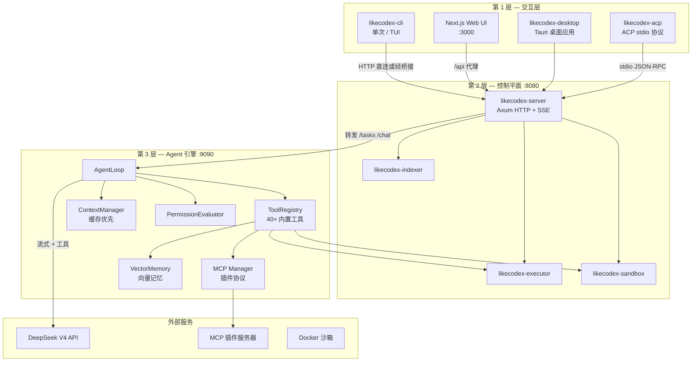

# LikeCodex

[](https://github.com/JasonBuildAI/likecodex/actions/workflows/ci.yml)
[](https://pypi.org/project/likecodex/)
[](https://pypi.org/project/likecodex/)
[](LICENSE)
[](https://www.python.org/downloads/)
[](https://www.rust-lang.org/)
[](https://nodejs.org/)
[](CONTRIBUTING.md)

**LikeCodex** 是一个由 **DeepSeek V4** 驱动的开源**编程 Agent**。你用自然语言描述任务，Agent 会阅读代码库、执行命令、修改文件并汇报结果；对高风险操作还可选择**人工审批**。

不同于简单的 LLM 封装或单体 Python 应用，LikeCodex 采用**刻意拆分**的架构：Rust 负责控制与安全 I/O，Python 负责 Agent 智能，Next.js 提供富交互 Web 界面。全系统针对 **DeepSeek 前缀缓存** 优化，使多轮工具循环既快又省。

**[English README](README.md)**

---

## 目录

- [LikeCodex 解决什么问题？](#likecodex-解决什么问题)
- [核心设计原则](#核心设计原则)
- [架构总览](#架构总览)
- [四层架构详解](#四层架构详解)
- [一次任务如何跑完](#一次任务如何跑完)
- [Agent 循环（系统心脏）](#agent-循环系统心脏)
- [缓存优先的上下文（LikeCodex 的差异化）](#缓存优先的上下文likecodex-的差异化)
- [规划、子 Agent 与 Skills](#规划子-agent-与-skills)
- [安全与执行路由](#安全与执行路由)
- [事件协议（所有客户端共享一条流）](#事件协议所有客户端共享一条流)
- [ACP 协议](#acp-协议)
- [快速开始](#快速开始)
- [配置说明](#配置说明)
- [内置工具](#内置工具)
- [项目结构](#项目结构)
- [文档索引](#文档索引)
- [许可证](#许可证)

---

## LikeCodex 解决什么问题？

编程 Agent 需要同时做好三件难事：

1. **推理** — 把模糊需求拆成步骤，调用工具，从错误中恢复。
2. **安全执行** — 读写文件、跑 shell，但不破坏你的机器。
3. **好用** — 终端和浏览器都能流式看进度，该问权限就问，会话能续聊。

LikeCodex 按职责分层，而不是把所有逻辑堆在一起：

| 关注点 | 层级 | 语言 | 为何放这里 |
|--------|------|------|-----------|
| 用户界面 | CLI、TUI、Web、Tauri 桌面 | Rust + TypeScript | 启动快、体验好 |
| HTTP 桥接、SSE、沙箱网关 | 控制平面 | Rust | 安全 I/O、统一事件总线 |
| LLM 循环、工具、规划、记忆 | Agent 引擎 | Python | Agent 逻辑迭代快 |
| Shell/Git 执行、Docker 隔离 | 执行层 | Rust | 路径约束、低开销 |

**默认模型：** `deepseek-v4-flash`，通过 [DeepSeek OpenAI 兼容 API](https://api.deepseek.com) 调用。可选规划模型：`deepseek-v4-pro`。

---

## 核心设计原则

### 1. 控制与智能分离

Rust 不直接调 LLM；Python 不绕过权限检查随意 spawn Docker。各层职责清晰：

- **Rust** — HTTP、SSE 广播、会话代理、本地/沙箱执行、配置加载、代码索引、ACP 协议。
- **Python** — `AgentLoop`、工具注册表、上下文组装与压缩、LLM 流式、MCP 集成、记忆管理。

改 Agent 行为（Python）不必重写安全边界（Rust）。

### 2. 所有客户端共享一条事件流

CLI、TUI、Web 都消费 `likecodex-server` 发出的**同一套 SSE 事件**。Python 输出原始 chunk，Rust 在 `event_mapping.rs` 中规范化。你在任何界面看到的工具卡片、权限弹窗、重试提示都是一致的。

### 3. 缓存稳定性是一等公民

DeepSeek **自动上下文缓存** 只有在 prompt 前缀（从 token 0 起）**字节级完全一致** 时才会命中。LikeCodex 把每段对话结构化为：

```text
┌─────────────────────────────────────┐
│ 不可变前缀（会话内不重写）            │  system.md + skills + 工具 schema
├─────────────────────────────────────┤
│ 只追加日志（向前增长）                │  user → assistant → tool → …
├─────────────────────────────────────┤
│ 易失草稿（不上送 API）                │  调试信息、规划器原始输出
└─────────────────────────────────────┘
```

这不是事后优化，而是会话、压缩、规划器隔离、工具 JSON 序列化的设计基础。详见 [缓存优先的上下文](#缓存优先的上下文likecodex-的差异化)。

### 4. 纵深防御

文件工具限制在工作区内；Shell 命令按风险分级；审批模式控制写入与执行；高风险命令可走 **Docker 沙箱**；写入前 **Checkpoint** 快照，支持回滚；配置支持 per-tool 的 allow/ask/deny 策略规则。

---

## 架构总览



**日常启动（推荐）：**

```bash
likecodex setup          # 首次：API Key、配置、LIKECODEX.md
likecodex start --web    # 引擎 :9090 + 服务 :8080 + Web :3000
likecodex code           # 纯终端 TUI
```

开发者仍可用 `scripts/dev.ps1` / `scripts/dev.sh` 做热重载开发。

---

## 四层架构详解

### 第 1 层 — 交互层

| 组件 | 入口 | 职责 |
|------|------|------|
| **likecodex-cli** | `likecodex`、`likecodex code`、`likecodex start` | 单次任务、Ratatui TUI、栈编排、`setup` / `doctor` |
| **web/** | http://127.0.0.1:3000 | 三栏 UI：会话 / 对话 / Diff；权限弹窗；会话续聊 |
| **likecodex-desktop** | Tauri 桌面应用 | 原生窗口包装 Web UI，1280x800 |
| **likecodex-acp** | stdio JSON-RPC | Agent Client Protocol v1，供编辑器（VS Code、Zed）集成 |

CLI 可**直连** Python 引擎（`--engine-url http://127.0.0.1:9090`），也可走 Rust 服务（与 Web 相同路径）。

### 第 2 层 — 控制平面（`likecodex-server`）

Rust Axum 服务，默认 **8080 端口**：

- **引擎桥接** — 转发 `POST /tasks`、`/chat`、`/run`、`/plan` 到 Python `:9090`。
- **事件总线** — `GET /events` SSE 流，服务所有客户端。
- **权限 API** — `GET /permissions/pending`、`POST /permissions/{id}/respond`。
- **执行网关** — `POST /execute` → 本地执行器或 Docker 沙箱。
- **健康与诊断** — `/health`、`/doctor`、`/config`、`/metrics`（代理引擎指标）。

核心 Crate：

| Crate | 职责 |
|-------|------|
| `likecodex-core` | 共享 `Config`、`Event`、`Task`、事件总线类型 |
| `likecodex-server` | HTTP 服务 + 引擎桥接 + SSE 映射 |
| `likecodex-executor` | 工作目录内的本地 shell/git 执行 |
| `likecodex-sandbox` | Docker 隔离执行（支持回退到本地） |
| `likecodex-indexer` | 文件索引 + CodeGraph 代码符号图 |

### 第 3 层 — Agent 引擎（`likecodex-engine`）

Python aiohttp 服务，**9090 端口**，系统**大脑**：

| 模块 | 职责 |
|------|------|
| `agent/loop.py` | 核心循环：LLM → 工具调用 → 结果 → 重复 |
| `agent/coordinator.py` | 双模型协调：Pro 规划器 + Flash 执行器 |
| `agent/planner.py` | 可选 JSON 步骤规划器 |
| `agent/plan_mode.py` | 只读规划模式：批准前禁止写入 |
| `agent/plan_state.py` | 规划状态跟踪 |
| `agent/auto_plan_classifier.py` | 自动判断是否需要规划 |
| `agent/goal.py` | 目标管理 |
| `agent/task.py` | 任务生命周期管理 |
| `agent/subagent.py` | 子 Agent 调用 |
| `agent/subagent_registry.py` | 子 Agent 注册 |
| `agent/subagent_store.py` | 子 Agent 状态存储 |
| `agent/autoresearch.py` | 自动研究模式 |
| `agent/guards.py` | 循环/风暴/重复 guard、空回答保护 |
| `agent/dispatch.py` | 并行工具调度 |
| `agent/streaming.py` | SSE 流处理与自动恢复 |
| `agent/checkpoints.py` | 写入前快照 |
| `agent/rewind.py` | 回滚恢复 |
| `agent/readiness.py` | 就绪检查 |
| `agent/evidence.py` | 证据账本 — 跟踪 todo/步骤完成 |
| `agent/commands.py` | 命令处理 |
| `agent/output_limit.py` | 输出长度限制 |
| `context/cache_first.py` | 不可变前缀 + 只追加日志 |
| `context/compaction.py` | 上下文接近上限时压缩尾部 |
| `context/manager.py` | 上下文组装 |
| `context/session_cache.py` | 会话缓存管理 |
| `context/session_resolver.py` | 会话解析 |
| `context/cache_shape.py` | 缓存形态分析 |
| `context/project_memory.py` | 项目记忆管理 |
| `context/instruction.py` | 指令管理 |
| `context/prune.py` | 上下文裁剪 |
| `tools/registry.py` | 40+ 内置工具注册 |
| `tools/filesystem.py` | 文件系统工具 |
| `tools/edit_file.py` | 文件编辑工具 |
| `tools/shell.py` | Shell 命令工具 |
| `tools/git.py` | Git 工具 |
| `tools/web_search.py` | 网络搜索 |
| `tools/web_fetch.py` | 网页抓取 |
| `tools/codegraph.py` | CodeGraph 代码图查询 |
| `tools/code_search.py` | 代码搜索 |
| `tools/code_index.py` | 代码索引 |
| `tools/lsp.py` | LSP 客户端 |
| `tools/lsp_tools.py` | LSP 工具集成 |
| `tools/agent_memory.py` | Agent 记忆工具 |
| `tools/ask.py` | 向用户提问 |
| `tools/todo.py` | Todo 管理 |
| `tools/plan_progress.py` | 规划进度跟踪 |
| `tools/history.py` | 历史记录 |
| `tools/cache.py` | 缓存管理 |
| `tools/notebook.py` | Notebook 集成 |
| `tools/code_review.py` | 代码审查 |
| `tools/deepseek_tools.py` | DeepSeek 专用工具 |
| `tools/encoding.py` | 编码检测 |
| `tools/path_utils.py` | 路径工具 |
| `permissions/evaluator.py` | 审批模式评估 |
| `permissions/policy.py` | 策略规则引擎 |
| `permissions/classifier.py` | Shell 风险分类 |
| `permissions/bash_readonly.py` | Bash 只读命令检测 |
| `llm/deepseek.py` | DeepSeek 供应商（流式、缓存指标、thinking 模式） |
| `llm/openai.py` | OpenAI 兼容供应商 |
| `llm/openai_stream.py` | OpenAI 流式处理 |
| `llm/factory.py` | LLM 供应商工厂 |
| `llm/base.py` | LLM 基类 |
| `llm/cache_metrics.py` | 缓存指标收集 |
| `llm/retry.py` | 重试逻辑 |
| `llm/tool_repair.py` | 工具调用修复 |
| `llm/errors.py` | LLM 错误类型 |
| `llm/mock.py` | Mock LLM 用于测试 |
| `mcp/client.py` | MCP 客户端（stdio JSON-RPC） |
| `mcp/manager.py` | MCP 连接管理器 |
| `mcp/loader.py` | MCP 配置加载（`.mcp.json` 发现） |
| `persistence/session.py` | SQLite 会话持久化 |
| `memory/vector.py` | 向量记忆（Chromadb/Faiss） |
| `skills/loader.py` | Skill 发现与加载 |
| `skills/runner.py` | Skill 执行引擎 |
| `hooks/runner.py` | 钩子系统（前置/后置执行） |
| `lsp/client.py` | LSP 客户端实现 |
| `lsp/manager.py` | LSP 连接管理器 |

### 第 4 层 — 外部服务

- **DeepSeek V4** — LLM 推理（OpenAI 兼容 `/chat/completions`）。
- **MCP 服务器** — 可选插件（fetch、filesystem、自定义工具），stdio JSON-RPC。
- **Docker** — 可选沙箱镜像 `likecodex/sandbox:latest`。

---

## 一次任务如何跑完

示例：在 Web UI 发送 *「给 `utils.py` 写单元测试并运行」*。

```text
 浏览器           Rust 服务 :8080        Python 引擎 :9090         DeepSeek
    │                    │                       │                      │
    │ POST /tasks        │                       │                      │
    │───────────────────►│ POST /tasks（转发）    │                      │
    │                    │──────────────────────►│ AgentLoop.run()      │
    │                    │                       │─────────────────────►│
    │                    │                       │◄─────────────────────│ tool_calls
    │                    │                       │ read_file, edit_file │
    │                    │                       │ run_command          │
    │                    │◄── 流式 chunk ────────│                      │
    │                    │ 映射 → EventBus       │                      │
    │ GET /events (SSE)  │                       │                      │
    │◄───────────────────│ stream_chunk          │                      │
    │                    │ tool_call_requested   │                      │
    │                    │ permission_requested? │                      │
    │                    │ task_completed        │                      │
```

**步骤说明：**

1. 客户端向 Rust `POST /tasks` 发送 `{ "prompt": "...", "session_id": "..." }`（CLI 同步任务可用 Python `POST /run`）。
2. Rust 创建客户端可见的 `task_id`，发出 `task_started`，转发给 Python。
3. Python **AgentLoop** 构建缓存优先上下文，带排序后的工具 schema 调用 DeepSeek。
4. 模型返回 tool calls → **权限检查** → 执行（只读工具可并行）。
5. 工具结果追加到历史 → 循环直到模型返回纯文本最终答案。
6. Rust 将 Python 输出映射为类型化 SSE 事件 → 所有订阅客户端实时更新。
7. `auto` 模式下如需审批，客户端调用 `POST /permissions/{id}/respond`，引擎继续执行。

复用 `session_id` 可保持不可变前缀「热」着，提高缓存命中率。

---

## Agent 循环（系统心脏）

`AgentLoop`（`packages/likecodex-engine/likecodex_engine/agent/loop.py`）流程：

```text
         ┌─────────────┐
         │  用户 prompt │
         └──────┬──────┘
                ▼
    ┌───────────────────────────┐
    │ 构建上下文（缓存优先）      │
    └─────────────┬─────────────┘
                  ▼
    ┌───────────────────────────┐
    │ 流式 LLM 回合（DeepSeek）  │
    └─────────────┬─────────────┘
                  │
      ┌───────────┴───────────┐
      │                       │
   纯文本                 tool_calls
      │                       │
      ▼                       ▼
  最终回答               权限闸门
 （+ 就绪检查）                │
                         允许 → 写入前 checkpoint
                              → 执行工具（只读工具可并行）
                              → 追加结果
                              → 循环（默认最多 50 步）
```

**关键机制：**

| 机制 | 作用 |
|------|------|
| **并行调度** | 连续只读工具并发执行 |
| **Guard** | 检测死循环、工具风暴、重复成功、空回答 |
| **流恢复** | SSE 中断时重试一次，保留部分 assistant 文本 |
| **压缩** | 上下文超约 80% 窗口时摘要尾部，前缀不变 |
| **Evidence 账本** | 跟踪 todo/步骤完成与验证命令 |
| **Checkpoint** | `write_file` / `edit_file` 前快照；`likecodex rewind` 回滚 |
| **Plan 模式** | 规划阶段仅只读工具，批准后才可写入 |
| **工具修复** | LLM 返回格式错误的工具调用时自动修复 |

---

## 缓存优先的上下文（LikeCodex 的差异化）

多数 Agent 把 prompt 当作不断变长的聊天记录。LikeCodex 把它当作**结构化文档**，分区严格（[完整规范](docs/SPEC-CACHE.md)）。

**为何重要：** 20 轮工具循环若不缓存，每轮都重发 system prompt + 工具 schema。DeepSeek 前缀缓存命中后，第 2–N 轮复用缓存 token，成本大幅下降——但前提是字节 0…N 不变。

**LikeCodex 的实现手段：**

| 手段 | 效果 |
|------|------|
| 版本化 `system.md`（>1024 token） | 稳定的 SYSTEM 消息 |
| 确定性排序的工具 JSON schema | 稳定的 API `tools` 参数 |
| Skills 索引在前缀、正文按需加载 | 稳定 skill 列表 |
| `LIKECODEX.md` / 项目记忆在前缀 | 项目上下文，会话内不重写 |
| 尾部 `[Context]` USER 块 | 动态信息不碰前缀 |
| 规划器独立会话 | Pro 规划不污染 Flash 执行器缓存 |
| 原始 tool call JSON 持久化 | 回合间无重序列化漂移 |
| 仅压缩尾部 | 修剪历史，永不重写 SYSTEM |

**查看缓存健康度：**

```bash
curl http://127.0.0.1:9090/metrics   # 引擎
curl http://127.0.0.1:8080/metrics   # 服务代理
likecodex stats
```

Web UI 顶栏显示实时缓存命中率。

---

## 规划、子 Agent 与 Skills

### 双模型协调器

复杂任务可跑**两个隔离会话**：

1. **规划器**（`deepseek-v4-pro`）— 只读工具，产出结构化计划。
2. **执行器**（`deepseek-v4-flash`）— 全量工具，落实计划。

会话隔离使执行器前缀缓存稳定，规划器可自由探索。

启用：`LIKECODEX_ENABLE_PLANNER=true`，或由 `coordinator.py` 自动判断。

### 子 Agent（`task` 工具）

把聚焦子任务委派给独立 Agent 运行，支持 `continue_from` / `fork_from` 复用 transcript。子 Agent 不含 `task` / `parallel_tasks` 等元工具，防止递归风暴。

### Skills

`.likecodex/skills/` 或内置（`explore`、`review`、`test-after-edit`）的 Markdown 剧本，通过 `run_skill` 调用；索引折叠进缓存稳定前缀。

### MCP 插件

通过 [Model Context Protocol](https://modelcontextprotocol.io) 扩展外部工具。配置在 `~/.likecodex/config.toml` 或项目 `.mcp.json`。持久 stdio 会话；工具名 `mcp__<server>__<tool>`。

### Token 经济模式

设置 `[agent] token_mode = "economy"` 可默认隐藏 MCP、LSP、skills、子 Agent 等可选工具的 schema。模型调用 `connect_tool_source(source)` 按需启用——长会话保持前缀精简。

---

## 安全与执行路由

| 审批模式 | 读取 | 写入 | Shell（中风险） | Shell（高风险） |
|----------|------|------|-----------------|-----------------|
| `read-only` | ✓ | ✗ | ✗ | ✗ |
| `auto`（默认） | ✓ | 询问 | 询问 | Docker 沙箱 |
| `full-access` | ✓ | ✓ | ✓ | 本地 |
| `sandbox-required` | ✓ | 沙箱 | 沙箱 | 沙箱 |

**防护层次：**

1. **路径约束** — 文件/git 工具不能逃出 `LIKECODEX_WORKING_DIR`。
2. **风险分类** — shell 命令标记为 read / medium / high。
3. **Bash 只读检测** — 40+ 已知只读命令（如 `git log`、`docker ps`、`npm ls`）自动放行，无需审批；30+ 危险模式（如 `rm -rf`、`curl|sh`、`sudo`）立即拒绝。
4. **策略规则** — per-tool 的 `allow` / `ask` / `deny`，支持 glob/字面量/前缀匹配：`Bash(go test:*)`、`Edit(docs/**)`、`Bash=go test ./...`。
5. **用户审批** — SSE `permission_requested` → 客户端响应。
6. **Docker 沙箱** — 隔离容器，CPU/内存限制。
7. **API Token** — `POST /execute` 可选 Bearer 认证。
8. **配置脱敏** — `/config` 不返回密钥。

详情：[SECURITY.md](SECURITY.md)

---

## 事件协议（所有客户端共享一条流）

所有客户端订阅 Rust 服务的 `GET /events`。事件为邻接 JSON 标签格式：

```json
{"type":"stream_chunk","payload":{"task_id":"…","content":"部分文本"}}
{"type":"tool_call_requested","payload":{"task_id":"…","call":{"name":"read_file",…}}}
{"type":"permission_requested","payload":{"task_id":"…","request":{…}}}
{"type":"stream_retrying","payload":{"task_id":"…","reason":"provider","attempt":1}}
{"type":"task_completed","payload":{"id":"…","status":"completed"}}
```

Python 输出较扁平的对象；`likecodex-server/src/event_mapping.rs` 规范化后，CLI、TUI、Web 渲染一致。

完整 schema：[docs/EVENTS.md](docs/EVENTS.md)

---

## ACP 协议

LikeCodex 通过 `likecodex-acp` 在 stdin/stdout 上暴露 **[Agent Client Protocol (ACP) v1](docs/ACP.md)** 端点，支持编辑器（VS Code、Zed 等）将 LikeCodex 作为子进程启动，通过 NDJSON JSON-RPC 2.0 通信。

**支持的方法：**

| 方法 | 说明 |
|------|------|
| `initialize` | 能力握手 |
| `session/new` | 创建新会话 |
| `session/load` | 加载并回放会话历史 |
| `session/resume` | 恢复已有会话 |
| `session/prompt` | 发送 prompt 并流式响应 |
| `session/cancel` | 取消正在执行的 turn |
| `session/set_config_option` | 运行时切换模型或审批模式 |
| `session/set_model` | 切换 LLM 模型 |
| `session/list` | 列出所有会话 |
| `session/close` | 关闭会话 |
| `session/delete` | 删除会话 |

**协议实现：** [`crates/likecodex-acp/`](crates/likecodex-acp/)

---

## Web UI — 对标 Cursor 的 Agent 体验

Next.js 15 Web UI 已全面升级，对标 Cursor 的 Agent 模式交互体验。开箱即用，现代、流畅、无障碍。

### 三态 Agent 模式

| 模式 | 颜色 | 行为 |
|------|------|------|
| **问答 (Ask)** | 🟢 翠绿 | 只读问答 — AI 回答但不修改文件 |
| **代理 (Agent)** | 🔵 蓝色 | 自动执行 — AI 自主读、写、运行命令 |
| **手动 (Manual)** | 🟠 琥珀 | 逐步确认 — 每次写入/执行需你审批 |

通过胶囊选择器切换，或按 `Tab` 快速循环。

### UI 亮点

- **56px 输入框** — 自动伸缩 textarea，悬停渐变光效，模式感知配色
- **增强消息气泡** — 渐变头像、时间戳、可折叠推理块、语法高亮代码块 + 复制按钮
- **流式动画** — 打字机效果、三点跳动思考指示器、闪烁光标、实时进度跟踪
- **Agent 活动面板** — 实时进度条、百分比显示、工具专属图标、执行耗时
- **@提及系统** — 毛玻璃下拉菜单、文件类型图标、键盘导航（↑↓/Enter/Esc）、分类结果（文件/文件夹/符号/Git/操作）
- **快捷键系统** — 30+ 快捷键分 5 类，按 `?` 打开帮助面板
- **新用户引导** — 首次访问 5 步交互教程，localStorage 记忆，随时跳过
- **性能优化** — 虚拟滚动、懒加载组件、防抖节流、骨架屏加载
- **无障碍** — 跳转导航链接、模态框焦点捕获、`prefers-reduced-motion` 支持、高对比度、字体调节
- **国际化** — 完整的中/英/日三语翻译系统，运行时切换

### 前端技术栈

| 技术 | 角色 |
|------|------|
| Next.js 15 + React 19 | SSR 框架 |
| TypeScript | 类型安全 |
| Tailwind CSS 3.4 | 原子化样式 + 自定义 Design Tokens |
| Zustand 5 | 轻量状态管理 |
| Framer Motion | 动画库（打字机、交错、布局动画） |
| @tanstack/react-virtual | 虚拟滚动处理大量消息 |

### 常用快捷键速查

| 快捷键 | 操作 |
|--------|------|
| `Ctrl+K` | 打开命令面板 |
| `Ctrl+B` | 切换侧边栏 |
| `Ctrl+Enter` | 发送消息 |
| `Ctrl+J` | 打开 Agent 面板 |
| `?` | 显示全部快捷键 |
| `Tab` | 切换 Agent 模式 |
| `Esc` | 停止生成 / 关闭面板 |

---

## 快速开始

### 环境要求

| 工具 | 版本 | 说明 |
|------|------|------|
| Python | 3.11+ | 必需（Agent 引擎） |
| uv | 最新 | 推荐包管理器 |
| Rust | 1.70+ | CLI 和服务必需 |
| Node.js | 20+ | Web UI 必需 |
| Docker | 可选 | 沙箱隔离 |

### 快速安装（仅 Python）

```bash
pip install likecodex

# 直接运行：
likecodex --setup                 # 首次配置
likecodex --chat                  # 交互式聊天
likecodex "修复这个 bug"          # 单次任务
```

### 完整安装（含 Rust CLI 和 Web UI）

```bash
git clone https://github.com/JasonBuildAI/likecodex.git
cd likecodex
uv sync --all-packages --extra dev
cd web && npm install --legacy-peer-deps && cd ..
cargo build --workspace
```

### 配置与运行

```bash
likecodex setup                    # 交互式向导（API Key、配置等）
likecodex start --web              # 全栈启动（引擎 + 服务 + Web）
likecodex doctor                   # 健康检查（含修复建议）

# 或纯终端：
likecodex code                     # TUI 交互模式
likecodex "修复 src/ 里失败的测试"  # 单次任务
```

Windows：先安装 MSVC Build Tools — `.\scripts\check-prerequisites.ps1`

---

## 配置说明

**合并优先级**（低 → 高）：

```text
默认值 → ~/.likecodex/config.toml → 祖先目录 likecodex.toml → 当前目录 likecodex.toml → 环境变量 → CLI 参数
```

示例 `~/.likecodex/config.toml`：

```toml
[llm]
provider = "deepseek"
model = "deepseek-v4-flash"
api_key = "..."                    # 或 DEEPSEEK_API_KEY 环境变量
base_url = "https://api.deepseek.com"

[approval]
mode = "auto"

[agent]
enable_planner = false
token_mode = "full"                # 或 "economy"

[mcp]
enabled = false
startup = "lazy"                   # 或 "eager"

[server]
port = 8080

[sandbox]
enabled = true
image = "likecodex/sandbox:latest"
allow_fallback = true
```

项目级覆盖：在仓库根目录创建 `./likecodex.toml`。

详见 [docs/USAGE.md](docs/USAGE.md) 与 [.env.example](.env.example)。

---

## 内置工具

| 类别 | 工具 |
|------|------|
| 文件系统 | `read_file`、`write_file`、`edit_file`、`multi_edit`、`glob`、`ls`、`move_file` |
| Shell | `run_command`、`bgjobs`、`bash_output`、`kill_shell`、`wait_job` |
| 搜索 | `grep_files`、`codegraph_search`、`codegraph_related`、`code_index`、`code_search`、LSP 工具 |
| Git | `git_status`、`git_diff`、`git_log`、`git_branch`、`git_commit`、`git_push` |
| 网络 | `web_search`、`web_fetch` |
| Agent 元 | `task`、`parallel_tasks`、`run_skill`、`todo_write`、`complete_step`、`ask` |
| 记忆 | `remember`、`forget`、`memory_search`、`history` |
| 代码审查 | `code_review`、`autoresearch` |
| 经济模式 | `connect_tool_source`（`token_mode = "economy"` 时） |
| MCP | `mcp__<server>__<tool>`（配置后） |
| Notebook | `notebook_cell`、`notebook_run` |

---

## 项目结构

```text
likecodex/
├── crates/                      # Rust 工作区（8 个 crate）
│   ├── likecodex-core/          # 配置、事件、共享类型
│   ├── likecodex-cli/           # CLI、TUI、start/setup/doctor
│   ├── likecodex-server/        # HTTP/SSE 控制平面
│   ├── likecodex-acp/           # Agent Client Protocol (ACP v1) stdio 服务端
│   ├── likecodex-executor/      # 本地命令执行
│   ├── likecodex-sandbox/       # Docker 沙箱（支持回退到本地）
│   ├── likecodex-indexer/       # 文件索引 + CodeGraph 代码符号图
│   └── likecodex-desktop/       # Tauri 桌面应用包装
├── packages/likecodex-engine/   # Python Agent 引擎（核心智能层）
│   └── likecodex_engine/
│       ├── agent/               # 循环、guard、规划器、协调器、checkpoint
│       ├── tools/               # 工具注册表 + 40+ 内置工具
│       ├── context/             # 缓存优先上下文 + 压缩 + 记忆
│       ├── llm/                 # LLM 供应商（DeepSeek、OpenAI、Mock）
│       ├── permissions/         # 审批模式 + 策略引擎 + 风险分类
│       ├── mcp/                 # MCP 客户端 + 加载器 + 管理器
│       ├── memory/              # 向量记忆（Chromadb/Faiss）
│       ├── persistence/         # SQLite 会话持久化
│       ├── skills/              # Skill 发现 + 执行引擎 + 内置包
│       ├── prompts/             # system.md 与提示词模板
│       ├── hooks/               # 钩子系统
│       ├── lsp/                 # LSP 语言服务客户端
│       └── static/              # 静态文件（Web UI lite 版）
├── web/                         # Next.js 15 Web UI（对标 Cursor 的 Agent 体验）
│   └── src/
│       ├── components/
│       │   ├── ui/              # Button, Input, Card, Badge, MotionDiv, MotionButton
│       │   ├── InputArea/       # 56px 输入框、ModeCapsule、ModelSelector
│       │   ├── MessageElements/ # 消息气泡、代码块、打字指示器
│       │   ├── Streaming/       # 流式响应、Agent活动面板、进度指示器
│       │   ├── Mention/         # 增强 @提及选择器
│       │   ├── Shortcuts/       # 快捷键帮助面板
│       │   ├── Onboarding/      # 欢迎引导 + 交互教程
│       │   ├── Performance/     # VirtualList、LazyComponent、骨架屏
│       │   └── Accessibility/   # SkipLinks、无障碍设置、AriaLiveRegion
│       ├── hooks/               # useGlobalShortcuts, useI18n, useAccessibility
│       └── lib/                 # animations, breakpoints, i18n, utils
├── docs/                        # 英文文档（架构、API、事件、规范）
├── doc/                         # 中文设计文档（6 篇）
├── docker/                      # Docker 镜像构建文件（sandbox + server）
├── services/                    # 附加服务（imbot 审批机器人）
├── benchmarks/                  # 基准测试（Agent + 缓存性能）
├── scripts/                     # 开发/安装脚本（.ps1 + .sh）
└── .github/                     # CI/CD 工作流 + Issue 模板
```

---

## 文档索引

| 文档 | 说明 |
|------|------|
| [README.md](README.md) | English documentation |
| [docs/ARCHITECTURE.md](docs/ARCHITECTURE.md) | 架构参考 |
| [docs/SPEC-CACHE.md](docs/SPEC-CACHE.md) | 缓存优先上下文规范 |
| [docs/SPEC-AGENT.md](docs/SPEC-AGENT.md) | Agent harness 规范 |
| [docs/API.md](docs/API.md) | HTTP API 参考 |
| [docs/ACP.md](docs/ACP.md) | ACP v1 协议规范 |
| [docs/EVENTS.md](docs/EVENTS.md) | SSE 事件 schema |
| [docs/USAGE.md](docs/USAGE.md) | 详细使用指南 |
| [docs/SECURITY.md](docs/SECURITY.md) | 安全策略 |
| [docs/PARITY-CHECKLIST.md](docs/PARITY-CHECKLIST.md) | 功能 ↔ 测试对照 |
| [docs/ROADMAP.md](docs/ROADMAP.md) | 路线图 |
| [doc/](doc/) | 中文设计文档（6 篇架构与优化方案） |
| [CHANGELOG.md](CHANGELOG.md) | 更新日志 |
| [CONTRIBUTING.md](CONTRIBUTING.md) | 贡献指南 |
| [CODE_OF_CONDUCT.md](CODE_OF_CONDUCT.md) | 行为准则 |

---

## 许可证

MIT — 见 [LICENSE](LICENSE)。

灵感来自 OpenAI Codex 及更广泛的 Agent 编程生态。
