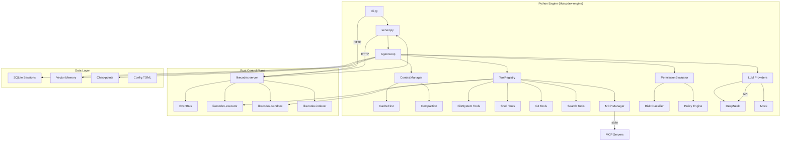

# LikeCodex Architecture

LikeCodex is a **Python-first** coding agent powered by **DeepSeek V4**, optimized for context cache hit rate. The architecture separates **intelligence (Python)** from **safety (Rust)**.

---

## Python-First Architecture

Unlike traditional hybrid agents where Python is a thin wrapper around Rust, LikeCodex places the **agent brain in Python** (`likecodex-engine`) while using **Rust for control, safety, and I/O**.

### Why Python-first?

| Factor | Benefit |
|--------|---------|
| **Rapid iteration** | Agent logic, tools, and prompts can be changed without Rust compilation |
| **Ecosystem** | Rich Python libraries for LLM integration, embeddings, and tool building |
| **Lower barrier** | Contributors can improve agent behavior without Rust knowledge |
| **Flexible deployment** | Python-only installation via pip works without Rust toolchain |

### Layer Diagram

```text
┌─────────────────────────────────────────────────────────────────────┐
│                        LAYER 1: INTERFACES                          │
│                                                                     │
│  ┌─────────────┐  ┌──────────────┐  ┌──────────┐  ┌──────────────┐ │
│  │ CLI (Python) │  │ Web (TS/React)│  │ Desktop  │  │ ACP (Rust)  │ │
│  │ likecodex    │  │ :3000        │  │ (Tauri)  │  │ stdio JSON  │ │
│  └──────┬──────┘  └──────┬───────┘  └────┬─────┘  └──────┬───────┘ │
└─────────┼────────────────┼───────────────┼───────────────┼─────────┘
          │                │               │               │
          ▼                ▼               ▼               ▼
┌─────────────────────────────────────────────────────────────────────┐
│                    LAYER 2: CONTROL PLANE (Rust)                     │
│                                                                     │
│  likecodex-server :8080  │  likecodex-executor  │  likecodex-sandbox │
│  Axum HTTP + SSE Bus    │  Local shell/git     │  Docker isolation  │
│  Session proxy          │  Path confinement    │  CPU/mem limits    │
│  Permission gateway     │  Risk classifier     │  Local fallback    │
├─────────────────────────────────────────────────────────────────────┤
│                    LAYER 3: AGENT ENGINE (Python)                    │
│                                                                     │
│  likecodex-engine :9090                                              │
│  ┌──────────┐ ┌──────────┐ ┌──────────┐ ┌──────────┐ ┌──────────┐  │
│  │AgentLoop │ │ToolReg   │ │Context   │ │LLM       │ │MCP       │  │
│  │Guards    │ │40+ tools │ │Cache-first│ │DeepSeek  │ │Plugin    │  │
│  │Coordinator│ │Registry  │ │Compaction│ │Mock      │ │Manager   │  │
│  └──────────┘ └──────────┘ └──────────┘ └──────────┘ └──────────┘  │
│  ┌──────────┐ ┌──────────┐ ┌──────────┐ ┌──────────┐              │
│  │Memory    │ │Skills    │ │Hooks     │ │LSP       │              │
│  │Vector DB │ │Playbooks │ │Pre/post  │ │Client    │              │
│  └──────────┘ └──────────┘ └──────────┘ └──────────┘              │
└─────────────────────────────────────────────────────────────────────┘
                              │
                              ▼
┌─────────────────────────────────────────────────────────────────────┐
│                    LAYER 4: EXTERNAL SERVICES                        │
│                                                                     │
│  DeepSeek V4 API  │  MCP Servers  │  Docker Sandbox  │  Git        │
│  OpenAI-compatible│  stdio JSON   │  likecodex/      │  remotes    │
│  /chat/completions │  RPC plugins │  sandbox:latest  │             │
└─────────────────────────────────────────────────────────────────────┘
```

---

## Module Relationship Diagram



---

## Data Flow

### Task Execution Flow

```text
User Prompt
    │
    ▼
┌──────────────────────────────────────────────┐
│ 1. Context Assembly (ContextManager)          │
│    - Load immutable prefix (system.md)        │
│    - Append session history                   │
│    - Inject project memory (LIKECODEX.md)     │
│    - Add dynamic context blocks               │
└──────────────────┬───────────────────────────┘
                   ▼
┌──────────────────────────────────────────────┐
│ 2. LLM Call (AgentLoop -> LLM Provider)      │
│    - Send request to DeepSeek API            │
│    - Stream response as SSE events           │
│    - Collect tool_calls                      │
└──────────────────┬───────────────────────────┘
                   │
          ┌────────┴────────┐
          ▼                 ▼
    Text Response     Tool Calls
          │                 │
          ▼                 ▼
┌──────────────────┐ ┌────────────────────────┐
│ 5a. Final Answer │ │ 3. Permission Check    │
│    Readiness     │ │    (PermissionEvaluator)│
│    Check         │ │    - Approval mode     │
│    Evidence      │ │    - Risk classifier   │
│    Ledger        │ │    - Policy rules      │
└──────────────────┘ └───────────┬────────────┘
                                │
                        Allowed │ Denied
                                │
                                ▼
                    ┌────────────────────────┐
                    │ 4. Tool Execution      │
                    │    - Checkpoint (writes)│
                    │    - Execute (parallel │
                    │      for read-only)    │
                    │    - Append results    │
                    │    - Loop (max 50)     │
                    └───────────┬────────────┘
                                │
                          Return to Step 2
```

### SSE Event Flow

```text
Python Engine          Rust Server              Clients (CLI/Web)
    │                      │                        │
    │  emit event          │                        │
    │─────────────────────►│  normalize & broadcast  │
    │                      │───────────────────────►│
    │                      │                        │
    │  emit tool_dispatch  │                        │
    │─────────────────────►│  map to typed SSE       │
    │                      │───────────────────────►│
    │                      │                        │
    │  emit task_completed │                        │
    │─────────────────────►│  broadcast to all       │
    │                      │───────────────────────►│
```

---

## Configuration Model

Configuration is loaded from multiple sources with increasing priority:

```text
┌─────────────────────────────────────────────────────────────┐
│                    Config Resolution Order                   │
│                                                             │
│  Lowest                                                     │
│    │  Built-in defaults (hardcoded in Rust)                 │
│    │  ~/.likecodex/config.toml (user-level)                 │
│    │  ./likecodex.toml (project-level, ancestor directories)│
│    │  Environment variables (LIKECODEX_* / DEEPSEEK_*)     │
│  Highest                                                     │
│    └  CLI flags (--port, --mode, --model)                  │
└─────────────────────────────────────────────────────────────┘
```

### Config Sections

| Section | Fields | Description |
|---------|--------|-------------|
| `[llm]` | `provider`, `model`, `api_key`, `base_url` | LLM configuration |
| `[approval]` | `mode` | `read-only`, `auto`, `full-access`, `sandbox-required` |
| `[agent]` | `enable_planner`, `token_mode`, `max_turns` | Agent behavior |
| `[server]` | `port`, `engine_url`, `api_token`, `host` | Server settings |
| `[sandbox]` | `enabled`, `image`, `allow_fallback`, `memory`, `cpus` | Sandbox settings |
| `[mcp]` | `enabled`, `startup`, `servers` | MCP plugin settings |
| `[deepseek]` | `thinking`, `cache` | DeepSeek-specific options |
| `[cache]` | `enabled` | Cache configuration |

---

## Cache Architecture

DeepSeek context caching requires a **byte-stable prefix** from token 0:

```
┌──────────────────────────────────────────────────────┐
│ IMMUTABLE PREFIX (never rewritten across turns)      │
│                                                        │
│  Token 0..N                                            │
│  ├── system.md (versioned, >1024 tokens)              │
│  ├── Project memory (LIKECODEX.md)                    │
│  ├── Skill index                                      │
│  └── Tool schemas (deterministically sorted JSON)     │
├──────────────────────────────────────────────────────┤
│ APPEND-ONLY LOG (grows forward, never edited)          │
│                                                        │
│  Token N+1..M                                          │
│  ├── User messages                                     │
│  ├── Assistant responses                               │
│  ├── Tool calls and results                            │
│  └── [Context] dynamic blocks                          │
├──────────────────────────────────────────────────────┤
│ VOLATILE SCRATCH (not sent to API)                     │
│                                                        │
│  ├── Debug logs                                        │
│  ├── Planner raw output                                │
│  └── Internal state                                    │
└──────────────────────────────────────────────────────┘
```

### Cache Optimization Techniques

| Technique | Description |
|-----------|-------------|
| Versioned `system.md` | Ensures stable SYSTEM message (>1024 tokens) |
| Deterministic tool sorting | JSON schemas sorted alphabetically for stability |
| Skills index in prefix | Skill listing in prefix, bodies loaded on demand |
| Tail-only compaction | Summarize history tail, never rewrite SYSTEM |
| Separate planner session | Pro planner in isolated session prevents executor cache pollution |
| Raw JSON persistence | Tool calls stored as raw JSON to prevent serialization drift |
| Session reuse | Same `session_id` preserves prefix across HTTP requests |

---

## Security Architecture

### Approval Modes

| Mode | Reads | Writes | Shell (medium) | Shell (high-risk) |
|------|-------|--------|----------------|-------------------|
| `read-only` | ✓ | ✗ | ✗ | ✗ |
| `auto` (default) | ✓ | Prompt | Prompt | Docker sandbox |
| `full-access` | ✓ | ✓ | ✓ | Local |
| `sandbox-required` | ✓ | Sandbox | Sandbox | Sandbox |

### Defense Layers

1. **Path confinement** — File/git tools cannot escape `LIKECODEX_WORKING_DIR`
2. **Risk classifier** — Shell commands tagged read/medium/high
3. **Bash read-only detection** — 40+ known read-only commands auto-approved; 30+ dangerous patterns denied
4. **Policy rules** — Per-tool allow/ask/deny with glob/literal/prefix matching
5. **User approval** — SSE `permission_requested` → client responds
6. **Docker sandbox** — Isolated container with CPU/memory limits
7. **API token** — Optional Bearer auth on `/execute`
8. **Config redaction** — Secrets never returned from `/config`

---

## Key Components

### Python Engine (`packages/likecodex-engine/`)

| Module | File(s) | Responsibility |
|--------|---------|----------------|
| Agent Loop | `agent/loop.py` | Core LLM → tools → results cycle |
| Coordinator | `agent/coordinator.py` | Dual-model Pro/Flash orchestration |
| Guards | `agent/guards.py` | Loop/storm/repeat/empty detection |
| Context | `context/cache_first.py`, `context/compaction.py` | Cache-optimized prompt assembly |
| Tools | `tools/registry.py` | 40+ built-in tool registration |
| LLM | `llm/deepseek.py`, `llm/mock.py` | LLM provider implementations |
| Permissions | `permissions/evaluator.py`, `permissions/policy.py` | Approval and policy engine |
| Memory | `memory/vector.py` | Chromadb/Faiss vector memory |
| MCP | `mcp/client.py`, `mcp/manager.py` | MCP plugin protocol |
| Persistence | `persistence/session.py` | SQLite session storage |
| Skills | `skills/loader.py`, `skills/runner.py` | Markdown playbook system |
| CLI | `cli.py` | Python CLI entry point |

### Rust Crates (`crates/`)

| Crate | Responsibility |
|-------|----------------|
| `likecodex-core` | Shared Config, Event, Task types |
| `likecodex-server` | Axum HTTP server + SSE EventBus + engine bridge |
| `likecodex-cli` | Terminal CLI, TUI, stack supervisor |
| `likecodex-acp` | Agent Client Protocol v1 (stdio JSON-RPC) |
| `likecodex-executor` | Local shell/git execution with path confinement |
| `likecodex-sandbox` | Docker-isolated command execution |
| `likecodex-indexer` | File index + CodeGraph symbol graph |
| `likecodex-desktop` | Tauri desktop app wrapper |

---

See [SPEC-CACHE.md](SPEC-CACHE.md) for detailed cache specification.
See [API.md](API.md) for HTTP API reference.
See [EVENTS.md](EVENTS.md) for SSE event schema.
